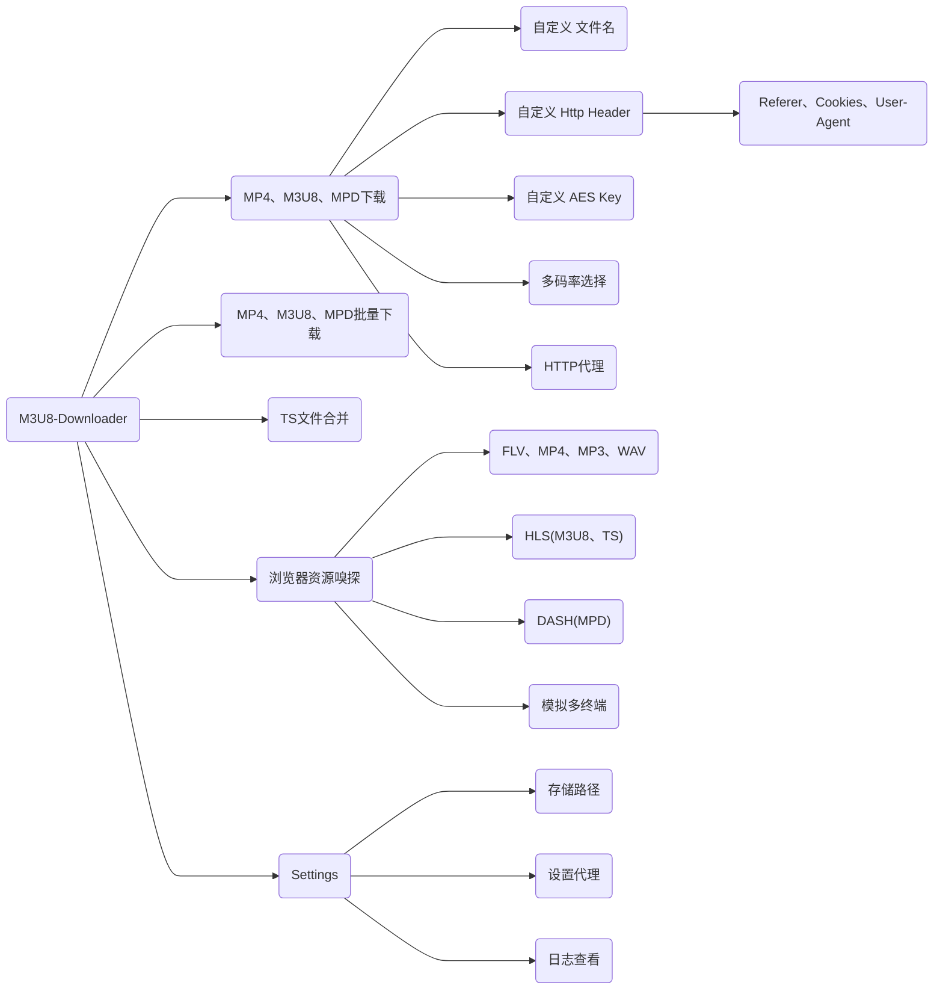

[](https://github.com/HeiSir2014/M3U8-Downloader/releases/latest)
[](https://github.com/HeiSir2014/M3U8-Downloader/releases/latest)
# M3U8-Downloader [直接下载](#下载可执行包)
M3U8-Downloader是基于Electron框架开发的一款可以下载、播放HLS视频流的APP，功能特点如下：

| 功能 | 支持 |
| :-- | --: |
| HLS协议点播源 | ✓ |
| 自定义Http协议头下载 | ✓ |
| 自定义KEY和IV解密 | ✓ |
| 本地M3U8文件下载 | ✓ |
| M3U8 直播源 | ✓ |
| 标准 AES-128-CBC加密 | ✓ |
| 标准 AES-196-CBC加密 | ✓ |
| 标准 AES-256-CBC加密 | ✓ |
| 非标准 AES-*-CBC加密 | ㄨ(可定制) |
| 网页嗅探视频源 | ✓ |


<div align="center">
    <br>
    
    <br>
</div>

# 功能规划




---

# 获取M3U8视频地址

在chrome浏览器打开视频网页，按下F12,页签点击到Network页面，在Filter框里输入"m3u8",然后按F5刷新页面，如果网页里的视频使用的是HLS源，就可以在这里捕获到视频流地址，然后选中右键 Copy -> Copy Link Address.
提供m3u8源地址，下载并无损转码Mp4文件

[自定义头添加-视频教程](https://player.bilibili.com/player.html?aid=498666070&bvid=BV1QK411n7VJ&cid=206827525&page=1)

# 下载可执行包

## 前往百度网盘下载

```
链接：https://pan.baidu.com/s/14zaMkxgfTC0HSge-Ze6EpQ 
提取码：m3u8 
复制这段内容后打开百度网盘手机App，操作更方便哦--来自百度网盘超级会员V1的分享
```

## Github 下载
## [Releases下载](https://github.com/HeiSir2014/M3U8-Downloader/releases)

# 运行源码
### NodeJS开发环境搭建

安装NodeJs最新版，[NodeJs Download](http://nodejs.cn/download/)

### Clone 代码

在任意文件夹下新建一个文件夹存放代码，并执行以下命令
```
cd newdir

git clone https://github.com/HeiSir2014/M3U8-Downloader.git .
```
### Yarn 环境安装

```
npm install yarn -g
```

### Package 依赖安装

```
yarn
```

ffmpeg-static 安装超时，可以尝试使用镜像:

```
FFMPEG_BINARIES_URL=https://cdn.npmmirror.com/binaries/ffmpeg-static yarn
```

### 运行M3U8-Downloader

```
yarn start
```
### 打包发布

```
//windows 平台打包
yarn pack-win

//mac 平台打包
yarn pack-mac

```

### Enjoy it

### 赞赏

[赞赏链接](https://tools.heisir.cn/HLSDownload/2019/07/08/02/)
